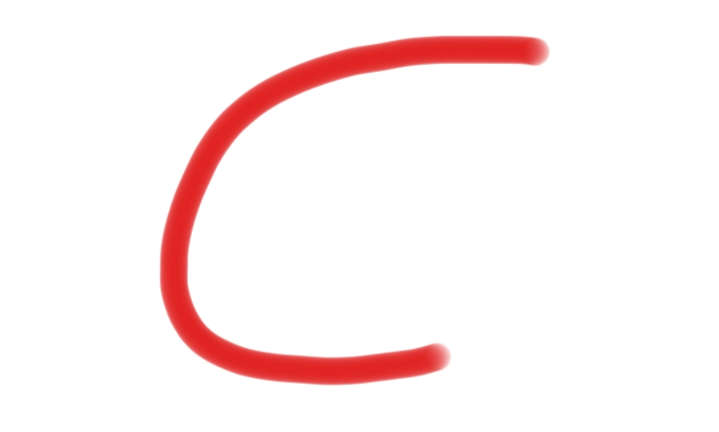
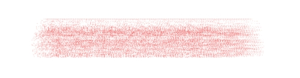
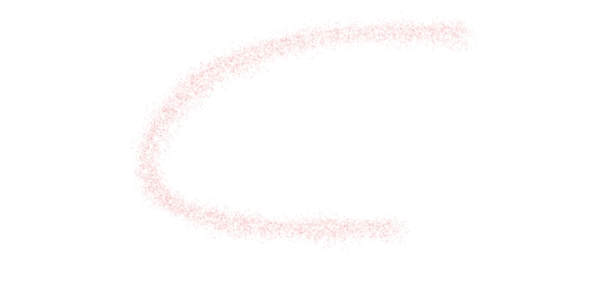

# Easy-Brush

Easy-Brush is a JavaScript brush engine designed for drawing on HTML5 canvas elements. It offers smooth Bezier curves for a natural drawing experience.

## Features

- Smooth Bezier curves
- Customizable brush color and size
- Easy integration with canvas events

## Installation

Include the Easy-Brush script in your Project:

```shell
npm install easy-brush
```

Import the library in your JavaScript file:

```javascript
import { Brush } from 'easy-brush';
```

## Usage

```javascript
const canvas = document.getElementById('yourCanvasId');
const config = {
    color: "#e00f0f",
    size: 28,
    flow: 0.2,
    opacity: 0.9,
    spacing: 0.08,
}
const brush = new Brush(canvas, config);

let isStarted = false;

canvas.addEventListener('mousedown', (e) => {
    isStarted = true;
});

canvas.addEventListener('mousemove', (e) => {
    if (!isStarted) return
    brush.putPoint(e.offsetX, e.offsetY, 0.5)
    brush.render()
});

canvas.addEventListener('mouseup', () => {
    isStarted = false;
    brush.finalizeStroke()
});
```

## Template
Default effect:


Use Brush Image:
```javascript
// If the image is in URL format, there will be a loading time
brush.loadImage(BrushImg, (isSuc) => {
    console.log(isSuc, "brush image load end");
})
```


### Modules
Use Shape Dynamics
```javascript
import { DynamicShape } from 'easy-brush';

brush.useModule(new DynamicShape({
    sizeJitter: 1,
    sizeJitterTrigger: "none",
    minDiameter: 0.5,
    angleJitter: 1,
    angleJitterTrigger: "none",
}))
```



## License
This project is licensed under the MIT License.
